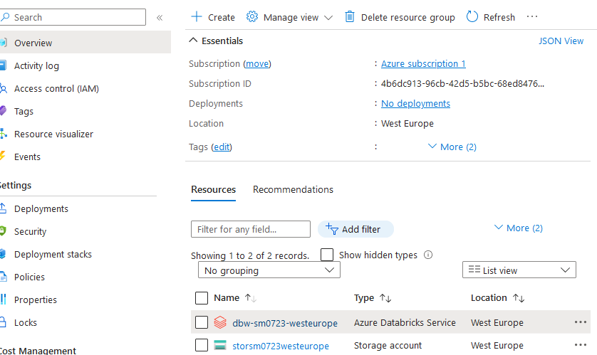

# Path to github repository: https://github.com/Andrey-Vospr/M07_SparkSQL_Python_AZURE


# Project Setup and Execution Guide

## Prerequisites
Before you begin, ensure you have the following installed:
- **Azure CLI (az)**: Used to interact with Azure services and manage resources.
- **Terraform**: Infrastructure as Code (IaC) tool for provisioning Azure resources.

## 🧭 Project Flow

### Step 1: Create a Storage Account in Azure for Terraform State
Create a storage account and blob container using either the Azure portal or CLI. This container will store the Terraform backend state.

### Step 2: Deploy Infrastructure with Terraform
Execute the following commands to initialize and apply your Terraform configuration:
```bash
terraform init                 # Initialize the directory
terraform plan -out terraform.plan    # Generate and save the execution plan
terraform apply terraform.plan # Apply the plan
```
This step provisions the necessary Databricks workspace and resources in Azure.

### Step 3: Set Up the Databricks Environment
1. **Initialize Environment**:
   Make the environment setup script executable and run it:
   ```sh
   chmod +x create-azure-env.sh
   ./create-azure-env.sh
   ```
   During execution, provide the following inputs:
   - **Azure region**: Location for the resources.
   - **Resource prefix**: Unique prefix for naming resources.
   - Confirm deployment by typing `yes` when prompted.

2. **Validate Workspace Creation**:
   - Navigate to the Azure Portal.
   - Open the resource group containing the Databricks service.
   - Launch the workspace using the "Launch Workspace" button.

3. **Additional Configurations**:
   - Configure Databricks secrets and cluster settings as needed.



### Step 4: Data Management and Analysis
1. **Import and Configure Notebooks**:
   In the Databricks workspace, import the `M07_SparkSQL_PYTHON_AZURE` notebook via the "Import" option in the "Workspace" tab.

   

   and running Notebook

   

2. **Data Integration**:
   Create delta tables for the `hotel/weather` 
   
   
   
   and `expedia` datasets within the Databricks environment.

   

3. **Execute Analytical Queries**:
   Run the notebook to perform the following tasks:
   - **Task 1**: Identify the top 10 hotels with the maximum absolute temperature difference by month.

         drop table if exists max_tmpr_diff_hotels;
         create external table max_tmpr_diff_hotels
         using parquet
         location 'abfss://data@${destStorageAccountName}.dfs.core.windows.net/max_tmpr_diff_hotels'
         partitioned by (year, month)
         as 
         select id, any_value(name) name, any_value(address) address, any_value(city) city, any_value(country) country, 
            date_format(any_value(wthr_date), 'yyyy-MM') wthr_month, 
            max(avg_tmpr_c) - min(avg_tmpr_c) tmpr_diff_c,
            any_value(year) year, any_value(month) month
         from hotel_weather
         group by id, trunc(wthr_date, 'month')
         order by tmpr_diff_c desc
         limit 10
   
      

   - **Task 2**: Determine the top 10 busiest hotels for each month.

         create table busy_hotels
         using parquet
         location 'abfss://data@storsm0723westeurope.dfs.core.windows.net/busy_hotels'
         partitioned by (year, month)
         as 
         select distinct hotel_id, name, address, city, country, date_format(srch_date, 'yyyy-MM') srch_month, srch_count,
            year(srch_date) year, month(srch_date) month
         from (
            select hotel_id, srch_date, count(srch_date) srch_count, row_number() over (partition by srch_date order by count(srch_date) desc) rn
            from (     
                  select hotel_id, explode(sequence(trunc(srch_ci, 'month'), trunc(srch_co, 'month'), interval 1 month)) as srch_date
                  from expedia
                  where srch_ci <= srch_co
            )
            group by hotel_id, srch_date
         ) visits 
            join hotel_weather hw on visits.hotel_id = hw.id
         where rn <= 10
         order by srch_month, srch_count desc;

        


   - **Task 3**: Analyze extended stays over 7 days for weather trends and average temperatures.
   
         drop table if exists extended_stays;
      
         create external table extended_stays
         using parquet
         location 'abfss://data@storsm0723westeurope.dfs.core.windows.net/extended_stays'
         as 
         select distinct hotel_id, srch_ci stay_start, srch_co stay_end, 
            avg_stay_tmpr_c, (last_day_tmpr_c - first_day_tmpr_c) tmpr_trend_c
         from (
            select hotel_id, srch_ci, srch_co,
                  avg(avg_tmpr_c) over stay as avg_stay_tmpr_c,
                  first_value(avg_tmpr_c) over stay as first_day_tmpr_c,
                  last_value(avg_tmpr_c) over stay as last_day_tmpr_c
            from expedia exp
                  left join hotel_weather hw on exp.hotel_id = hw.id
                     and wthr_date between srch_ci and srch_co
            where datediff(srch_co, srch_ci) > 7
            order by hotel_id, srch_ci, srch_co
            window stay as (
                  partition by hotel_id, srch_ci, srch_co 
                  order by wthr_date 
                  rows between unbounded preceding and unbounded following)
         );
   
        

### Step 5: Running Locally with Spark
For local development:
1. **Install Required JARs**:
   Download and place the following JARs in your Spark installation's `jars` directory:
   - [spark-avro_2.12](https://repo1.maven.org/maven2/org/apache/spark/spark-avro_2.12/3.4.1/spark-avro_2.12-3.4.1.jar)
   - [delta-storage](https://repo1.maven.org/maven2/io/delta/delta-storage/2.4.0/delta-storage-2.4.0.jar)

2. **Install Dependencies**:
   ```sh
   pip install -r requirements.txt
   ```

3. **Execute the Program**:
   ```sh
   python3 src/sparksql/hotel_stays.py <src_storage_account> <src_storage_account_key> <src_storage_container> <delta_dir>
   ```
   Replace placeholders with actual values from your Azure storage account and local environment.

## Results
This project will result in:
- A repository with the notebook outputs, configuration scripts, application sources, and execution plan analyses.
- A README file with links to the repository, fully documented steps, screenshots, and detailed comments.

Thank you for setting up and running this project!
